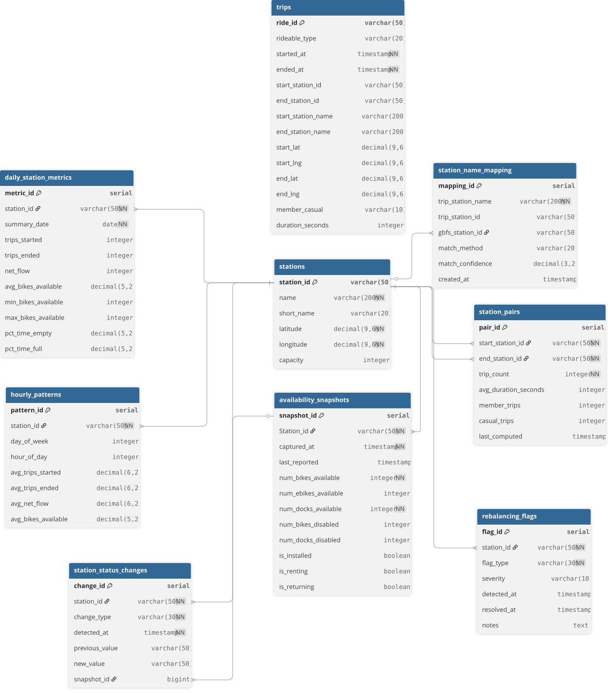

# CitiBike Station Rebalancing Analysis

A data engineering project that identifies chronically problematic CitiBike stations to help operators rebalance bikes proactively rather than reactively.

**Live Demo:** [Click Here](https://rime11.github.io/citibike-rebalancing-api/citibike_dashboard_prototype.html) | **Stack:** PostgreSQL · Flask · Python · AWS Lightsail


**Schema** 
---
## The Problem

CitiBike moves bikes between stations by truck, an expensive process that is usually reactive: a station is found empty after riders have already been stranded. This project collects station availability every 5 minutes and answers one question:

Which stations fail over and over during weekday rush hour, how long do they stay failed, and which way does rider demand push them?

The flags describe recurring patterns, not what is happening at this moment.

## What It Produces

**Rebalancing flags**: one row per station, per flag type, per rush window (weekday 7:00–9:59 AM, weekday 17:00–19:59 PM).

| Flag | Meaning | Metric | Severity (low / medium / high) |
|---|---|---|---|
| `chronic_empty` | Often has 0 bikes during rush hour | % of in-service rush snapshots with 0 bikes | ≥ 10% / 25% / 50% |
| `chronic_full` | Often has 0 open docks during rush hour | % of in-service rush snapshots with 0 docks | ≥ 10% / 25% / 50% |
| `imbalance_toward_empty` | Riders drain it over the window | net bikes lost per weekday, as % of capacity | ≥ 50% / 75% / 100% |
| `imbalance_toward_full` | Riders fill it over the window | net bikes gained per weekday, as % of capacity | ≥ 50% / 75% / 100% |

Chronic flags also carry `median_outage_minutes` and `outage_count`, which separate a station that blips empty for 2 minutes from one that stays empty for an hour.

**Flask dashboard and REST API**: system-wide trends, worst stations by flag type, hourly demand heatmaps, and per-station history and trip flow.
## Data Souces:
There are 3 data sources:
- availability_snapshots and stations data are from the GBFS live data 
- trips from s3

---

## Architecture

```
GBFS API (every 5 min)            CitiBike S3 trip CSVs (monthly)
station_status / station_info              |
        |                                  |
        ▼                                  ▼
availability_snapshots, stations        trips
        |                                  |
        ▼ detect transitions               ▼
station_status_changes             hourly_patterns
        |                                  |
        ▼ pair start ↔ end                 |
station_outages (view)                     |
        |                                  |
        └──────────────┬───────────────────┘
                       ▼
               rebalancing_flags   +   daily_station_metrics
                       |
                       ▼
             Flask API + Dashboard
```

---

## Data Model

**Source tables** (loaded by ETL)
- `stations`: one row per station (~2,400), from the GBFS station feed
- `availability_snapshots`: one row per station every 5 minutes (~9.6M rows over 14 days)
- `trips`: one row per historical trip from CitiBike S3 (~3.8M rows)

**Derived tables** (rebuilt by scheduled jobs)
- `station_status_changes`: one row per state transition (became empty, recovered, went offline, …). Compresses millions of snapshots into a small event log.
- `daily_station_metrics`: one row per station per day: trips started/ended, average/min/max bikes, % of in-service time empty/full
- `hourly_patterns`: one row per station × day of week × hour: average trips started/ended and net flow
- `rebalancing_flags`: one row per station per flag type per rush window

**View** (computed when queried)
- `station_outages`: one row per outage episode: start, end, minutes, whether it is still ongoing, and whether it overlapped an offline period

---

## Pipeline and Schedule

| Job | Runs | Refresh style |
|---|---|---|
| Collect snapshots + detect status changes | every 5 min | append new rows only |
| `daily_station_metrics` | nightly | recompute the last 3 days |
| `rebalancing_flags` | weekly | full rebuild in one transaction |
| `hourly_patterns` | after each monthly trips load | full rebuild |
| `station_outages` | on read | view |

Three kinds of SQL scripts:
- **Schema** (`sql_scripts/citibike_schema.sql`): creates empty tables. Runs once.
- **Backfill** (`sql_scripts/backfill/`): fills a table from all history. Runs once at setup.
- **Jobs** (`sql_scripts/jobs/`): keeps a table current. Runs on a schedule.

The schedule lives in [`deploy/crontab`](deploy/crontab).

---

## Time Zones

All event timestamps (`captured_at`, `last_reported`, `started_at`, `ended_at`) are stored as `TIMESTAMPTZ`.

- GBFS snapshots arrive in UTC and are tagged as UTC at ingestion.
- Trip CSVs are in New York local time and are tagged `America/New_York` at load.
- The database time zone is set so that hour-of-day and day-of-week logic uses New York time:
  ```sql
  ALTER DATABASE citibike SET timezone = 'America/New_York';
  ```

---

---

## Running It

### Local (dashboard only)

**Prerequisites:** PostgreSQL, Python 3.9+

```bash
git clone https://github.com/rime11/citibike-rebalancing-api
cd citibike-rebalancing-api
pip install -r requirements.txt
cp .env.example .env            # fill in your PostgreSQL credentials
psql -d citibike -f sql/citibike_schema.sql
python app.py                   # http://localhost:5000
```
### Full pipeline on AWS Lightsail

```bash
# 1. Empty tables
psql -d citibike -f sql/citibike_schema.sql

# 2. Source data (stations first; other tables reference it)
python3 python/load_station_info.py
python3 python/fetch_snapshots.py && python3 python/load_snapshots_data.py
python3 python/load_trips.py 202601-citibike-tripdata.csv

# 3. One-time build of every derived table, in dependency order
scripts/build_all.sh

# 4. Turn on the schedule
crontab deploy/crontab
```
## Project Structure

```
citibike-rebalancing-api/
├── citibike_api 
        ├── app.py                  # Flask routes
        ├── db.py                   # Database connection
        ├── queries.py              # Dashboard and API queries
        ├── templates/              # Dashboard HTML
├── data_collection/                # ETL: fetch/load snapshots, stations, trips
├── schema
│   ├── citibike_schema.sql         # Full schema DDL
├── sql_scripts            
│   ├── backfill/                   # One-time builds
│   ├──refresh/                     # Scheduled refreshes
|   └── jobs                        # build_all.sh, collect.sh, run_sql.sh, load_trips.sh
├── deploy/crontab                  # Production schedule
├── notebooks/                      # Exploration
├── .env.example
└── requirements.txt
```
---

## Key Technical Decisions

**`short_name` for station ID matching.** The GBFS feed and the trip CSVs use different station ID formats. Matching on `short_name` resolves ~99% of stations without a separate mapping table.

**Out-of-service snapshots are excluded.** A station switched off for maintenance reports 0 bikes. Counting that as "empty" would flag broken stations as rebalancing problems, so empty rates use only snapshots where the station is installed and renting, and full rates only where it is installed and accepting returns.

**AM and PM are separate windows.** A station near offices fills in the morning and drains in the evening. Averaged together it looks balanced; split, it gets two flags with opposite actions.

**Ongoing outages are excluded from duration.** An outage still in progress at refresh time has an unknown end (right-censored), so including it would bias median durations low. Outages that overlap an offline period are excluded too, since a truck can't fix those.

**Data driven severity thresholds.** Chronic severity cutoffs (10% / 25% / 50%) come from the distribution of empty and full rates across stations, not arbitrary round numbers.

**Views compute on read, tables on a schedule.** Outage episodes are a view, so they always match the event log. Flags are a table: a weekly decision that stays fixed until the next run.

**cron, not Airflow.** A handful of jobs on fixed schedules don't need a scheduler with a web UI. Each job runs on the cadence of the data that changes it, and every job is safe to re-run.

---
## Limitations

- Snapshots cover 14 days and trips about 2 months, so imbalance averages rest on about 8 days per weekday. More months would make them more stable.
- Chronic flags use recent snapshots, while imbalance flags use the full trip window, so the two describe slightly different periods.
- Trip data is published monthly, so recent days have no trip counts yet. These are stored as NULL ("not published"), not 0.

---

## Data Sources

- Real-time availability: CitiBike GBFS feed, `https://gbfs.lyft.com/gbfs/2.3/bkn/en/station_status.json`
- Historical trips: CitiBike S3, `https://s3.amazonaws.com/tripdata/index.html` (not included in the repo due to size)

---

*DTSC 691 Database Capstone, Eastern University*


